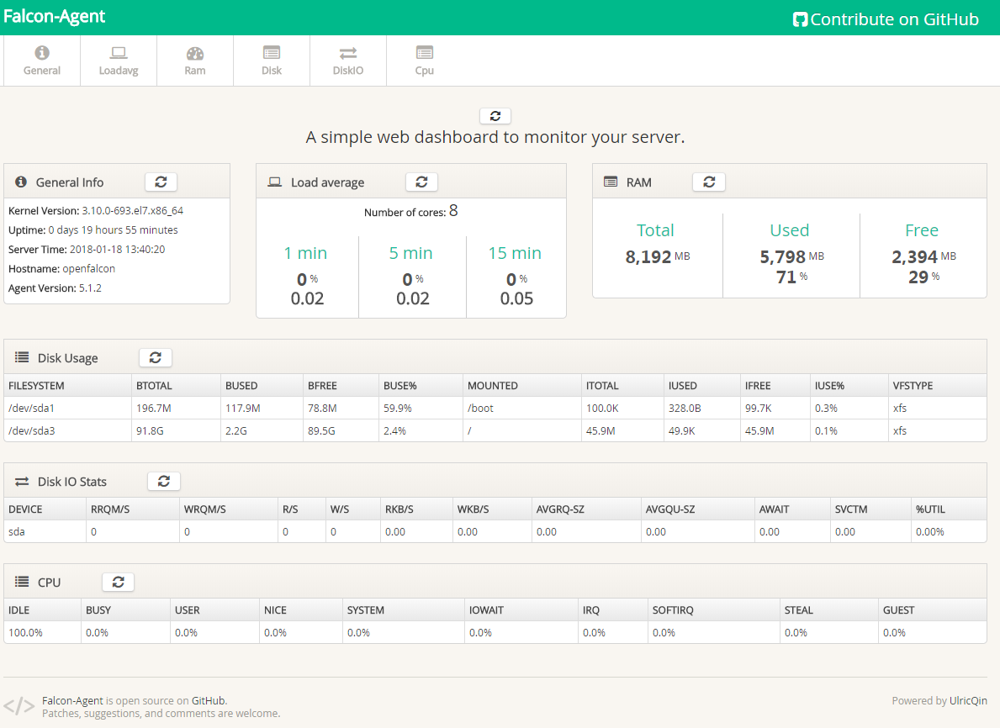

## 切换源为阿里源(非必须，个人习惯)

- 备份默认的yum `mv /etc/yum.repos.d /etc/yum.repos.d.backup`

- 设置新的yum目录 `mkdir /etc/yum.repos.d`

- 下载阿里yum配置到该目录中 `wget -O /etc/yum.repos.d/CentOS-Base.repo http://mirrors.aliyun.com/repo/Centos-7.repo`

- 重建缓存

```shell
sudo yum clean all
sudo yum makecache
```

- 升级所有包（改变软件设置和系统设置，系统版本内核都升级，故需要几分钟耐心等待`yum update -y`

## 安装git

- 使用yum命令安装 `sudo yum install -y git`

- 安装结束后安全起见，确认是否满足官方要求的Git >= 1.7.5 `git version`

## 安装go语言环境

- 因为官方yum和阿里yum都没有go的安装包，故只能通过fedora的epel仓库来安装

``` shell
yum install -y epel-release
yum install golang -y
```

- 安装结束后安全起见，确认是否满足官方要求的Go >= 1.6 `go version`

## 安装redis

- 由于部署go时已经安装了epel，故直接执行下面的安装命令（如果没有装epel，会提示No package redis available，也就是没有安装包可用，因为官方yum和阿里yum都没有redis，故只能通过fedora的epel仓库来安装） `yum install redis -y`

- 启动redis  `sudo systemctl start redis`

- 设置redis开机启动 `sudo systemctl enable redis`

- 可以用下面的语句查看redis是否开启 `sudo systemctl status redis`

## 安装mysql

- Centos7自带的mysql是mariadb ,我们可以通过如下命令查看 `yum search mysql|tac`

- 开始安装mariadb `sudo yum -y install mariadb mariadb-server`

- 设置开机自启动mysql `sudo systemctl enable mariadb.service`

- 启动mysql   `sudo systemctl start mariadb.service`

- 初始化mysql数据库，并配置root用户密码 `sudo mysql_secure_installation`

## 安装open falcon

获取open falcon 二进制包，有两种方式

- 方式一：下载源代码，然后手动编译 `go env` 获取GOPATH的位置

    ```shell
    cd $GOPATH && mkdir src/github.com/open-falcon && cd src/github.com/open-falcon

    git clone https://github.com/open-falcon/falcon-plus.git

    make all

    make pack

    ```

    以上步骤完成之后，在$GOPATH/src/github.com/open-falcon/falcon-plus 目录下，可以找到open-falcon-v0.2.1.tar.gz文件

- 方式二：下载 open falcon 二进制包 `wget https://github.com/open-falcon/falcon-plus/releases/download/v0.2.1/open-falcon-v0.2.1.tar.gz`

- 创建工作目录，并解压二进制包到工作目录下 `cd ~ && mkdir open-falcon && tar xf open-falcon-v0.2.1.tar.gz -C open-falcon`

- 初始化mysql表结构

    ```shell
    cd ~ && git clone https://github.com/open-falcon/falcon-plus.git

    cd ./falcon-plus/scripts/mysql/db_schema/

    mysql -h 127.0.0.1 -u root -p < 1_uic-db-schema.sql

    mysql -h 127.0.0.1 -u root -p < 2_portal-db-schema.sql

    mysql -h 127.0.0.1 -u root -p < 3_dashboard-db-schema.sql

    mysql -h 127.0.0.1 -u root -p < 4_graph-db-schema.sql

    mysql -h 127.0.0.1 -u root -p < 5_alarms-db-schema.sql

    cd ~

    rm -rf ./falcon-plus/

    ```
- 配置Agent

    agent用于采集机器负载监控指标，比如cpu.idle、load.1min、disk.io.util等等，每隔60秒push给Transfer。agent与Transfer建立了长连接，数据发送速度比较快，agent提供了一个http接口/v1/push用于接收用户手工push的一些数据，然后通过长连接迅速转发给Transfer。 `vi ~/open-falcon/agent/config/cfg.json`

    ```json
    {
        "debug": true,  # 控制一些debug信息的输出，生产环境通常设置为false
        "hostname": "", # agent采集了数据发给transfer，endpoint就设置为了hostname，默认通过`hostname`获取，如果配置中配置了hostname，就用配置中的
        "ip": "", # agent与hbs心跳的时候会把自己的ip地址发给hbs，agent会自动探测本机ip，如果不想让agent自动探测，可以手工修改该配置
        "plugin": {
            "enabled": false, # 默认不开启插件机制
            "dir": "./plugin",  # 把放置插件脚本的git repo clone到这个目录
            "git": "https://github.com/open-falcon/plugin.git", # 放置插件脚本的git repo地址
            "logs": "./logs" # 插件执行的log，如果插件执行有问题，可以去这个目录看log
        },
        "heartbeat": {
            "enabled": true,  # 此处enabled要设置为true
            "addr": "127.0.0.1:6030", # hbs的地址，端口是hbs的rpc端口
            "interval": 60, # 心跳周期，单位是秒
            "timeout": 1000 # 连接hbs的超时时间，单位是毫秒
        },
        "transfer": {
            "enabled": true,
            "addrs": [
                "127.0.0.1:18433"
            ],  # transfer的地址，端口是transfer的rpc端口, 可以支持写多个transfer的地址，agent会保证HA
            "interval": 60, # 采集周期，单位是秒，即agent一分钟采集一次数据发给transfer
            "timeout": 1000 # 连接transfer的超时时间，单位是毫秒
        },
        "http": {
            "enabled": true,  # 是否要监听http端口
            "listen": ":1988",
            "backdoor": false
        },
        "collector": {
            "ifacePrefix": ["eth", "em"], # 默认配置只会采集网卡名称前缀是eth、em的网卡流量，配置为空就会采集所有的，lo的也会采集。可以从/proc/net/dev看到各个网卡的流量信息
            "mountPoint": []
        },
        "default_tags": {
        },
        "ignore": {  # 默认采集了200多个metric，可以通过ignore设置为不采集
            "cpu.busy": true,
            "df.bytes.free": true,
            "df.bytes.total": true,
            "df.bytes.used": true,
            "df.bytes.used.percent": true,
            "df.inodes.total": true,
            "df.inodes.free": true,
            "df.inodes.used": true,
            "df.inodes.used.percent": true,
            "mem.memtotal": true,
            "mem.memused": true,
            "mem.memused.percent": true,
            "mem.memfree": true,
            "mem.swaptotal": true,
            "mem.swapused": true,
            "mem.swapfree": true
        }
    }

    ```

    启动agent命令 `~/open-falcon/open-falcon start agent`

    停止agent命令 `~/open-falcon/open-falcon stop agent`

    监控agent命令 `~/open-falcon/open-falcon monitor agent`

    防火墙开放1988端口

    ```shell
     sudo firewall-cmd --add-port=1988/tcp --permanent
     sudo firewall-cmd --reload
    ```

    浏览器访问http://ip:1988 端口,即可看到agent采集到的数据

    

- 配置Transfer

    transfer是数据转发服务。它接收agent上报的数据，然后按照哈希规则进行数据分片、并将分片后的数据分别push给graph&judge等组件。`vi ~/open-falcon/transfer/config/cfg.json`

    ```json
    {
        "debug": true,
        "minStep": 30,
        "http": {
            "enabled": true,
            "listen": "0.0.0.0:6060"
        },
        "rpc": {
            "enabled": true,
            "listen": "0.0.0.0:8433"
        },
        "socket": {
            "enabled": false,
            "listen": "0.0.0.0:4444",
            "timeout": 3600
        },
        "judge": {
            "enabled": true,
            "batch": 200,
            "connTimeout": 1000,
            "callTimeout": 5000,
            "maxConns": 32,
            "maxIdle": 32,
            "replicas": 500,
            "cluster": {
                "judge-00" : "127.0.0.1:6080"
            }
        },
        "graph": {
            "enabled": true,
            "batch": 200,
            "connTimeout": 1000,
            "callTimeout": 5000,
            "maxConns": 32,
            "maxIdle": 32,
            "replicas": 500,
            "cluster": {
                "graph-00" : "127.0.0.1:6070"
            }
        },
        "tsdb": {
            "enabled": false,
            "batch": 200,
            "connTimeout": 1000,
            "callTimeout": 5000,
            "maxConns": 32,
            "maxIdle": 32,
            "retry": 3,
            "address": "127.0.0.1:8088"
        }
    }

    ```

    配置说明
    ```text
    debug: true/false, 如果为true，日志中会打印debug信息

    minStep: 30, 允许上报的数据最小间隔，默认为30秒

    http
        - enabled: true/false, 表示是否开启该http端口，该端口为控制端口，主要用来对transfer发送控制命令、统计命令、debug命令等
        - listen: 表示监听的http端口

    rpc
        - enabled: true/false, 表示是否开启该jsonrpc数据接收端口, Agent发送数据使用的就是该端口
        - listen: 表示监听的http端口

    socket #即将被废弃,请避免使用
        - enabled: true/false, 表示是否开启该telnet方式的数据接收端口，这是为了方便用户一行行的发送数据给transfer
        - listen: 表示监听的http端口

    judge
        - enabled: true/false, 表示是否开启向judge发送数据
        - batch: 数据转发的批量大小，可以加快发送速度，建议保持默认值
        - connTimeout: 单位是毫秒，与后端建立连接的超时时间，可以根据网络质量微调，建议保持默认
        - callTimeout: 单位是毫秒，发送数据给后端的超时时间，可以根据网络质量微调，建议保持默认
        - pingMethod: 后端提供的ping接口，用来探测连接是否可用，必须保持默认
        - maxConns: 连接池相关配置，最大连接数，建议保持默认
        - maxIdle: 连接池相关配置，最大空闲连接数，建议保持默认
        - replicas: 这是一致性hash算法需要的节点副本数量，建议不要变更，保持默认即可
        - cluster: key-value形式的字典，表示后端的judge列表，其中key代表后端judge名字，value代表的是具体的ip:port

    graph
        - enabled: true/false, 表示是否开启向graph发送数据
        - batch: 数据转发的批量大小，可以加快发送速度，建议保持默认值
        - connTimeout: 单位是毫秒，与后端建立连接的超时时间，可以根据网络质量微调，建议保持默认
        - callTimeout: 单位是毫秒，发送数据给后端的超时时间，可以根据网络质量微调，建议保持默认
        - pingMethod: 后端提供的ping接口，用来探测连接是否可用，必须保持默认
        - maxConns: 连接池相关配置，最大连接数，建议保持默认
        - maxIdle: 连接池相关配置，最大空闲连接数，建议保持默认
        - replicas: 这是一致性hash算法需要的节点副本数量，建议不要变更，保持默认即可
        - cluster: key-value形式的字典，表示后端的graph列表，其中key代表后端graph名字，value代表的是具体的ip:port(多个地址用逗号隔开, transfer会将同一份数据发送至各个地址，利用这个特性可以实现数据的多重备份)

    tsdb
        - enabled: true/false, 表示是否开启向open tsdb发送数据
        - batch: 数据转发的批量大小，可以加快发送速度
        - connTimeout: 单位是毫秒，与后端建立连接的超时时间，可以根据网络质量微调，建议保持默认
        - callTimeout: 单位是毫秒，发送数据给后端的超时时间，可以根据网络质量微调，建议保持默认
        - maxConns: 连接池相关配置，最大连接数，建议保持默认
        - maxIdle: 连接池相关配置，最大空闲连接数，建议保持默认
        - retry: 连接后端的重试次数和发送数据的重试次数
        - address: tsdb地址或者tsdb集群vip地址, 通过tcp连接tsdb.
    ```

    启动transfer命令 `~/open-falcon/open-falcon start transfer`

    停止transfer命令 `~/open-falcon/open-falcon stop transfer`

    监控transfer命令 `~/open-falcon/open-falcon monitor transfer`

    防火墙开放6060、8433端口

    ```shell
     sudo firewall-cmd --add-port=6060/tcp --permanent
     sudo firewall-cmd --add-port=8433/tcp --permanent
     sudo firewall-cmd --reload
    ```

    校验服务,这里假定服务开启了6060的http监听端口。检验结果为ok表明服务正常启动。`curl -s "127.0.0.1:6060/health"`

    部署完成transfer组件后，请修改agent的配置，使其指向正确的transfer地址。在安装完graph和judge后，请修改transfer的相应配置、使其能够正确寻址到这两个组件。

- 配置Graph

    graph是存储绘图数据的组件。graph组件 接收transfer组件推送上来的监控数据，同时处理api组件的查询请求、返回绘图数据。`vi ~/open-falcon/graph/config/cfg.json`

    ```json
    {
        "debug": false, //true or false, 是否开启debug日志
        "http": {
            "enabled": true, //true or false, 表示是否开启该http端口，该端口为控制端口，主要用来对graph发送控制命令、统计命令、debug命令
            "listen": "0.0.0.0:6071" //表示监听的http端口
        },
        "rpc": {
            "enabled": true, //true or false, 表示是否开启该rpc端口，该端口为数据接收端口
            "listen": "0.0.0.0:6070" //表示监听的rpc端口
        },
        "rrd": {
            "storage": "./data/6070" // 历史数据的文件存储路径（如有必要，请修改为合适的路）
        },
        "db": {
            "dsn": "root:password@tcp(127.0.0.1:3306)/graph?loc=Local&parseTime=true", //MySQL的连接信息，默认用户名是root，密码为空，host为127.0.0.1，database为graph（如有必要，请修改)
            "maxIdle": 4  //MySQL连接池配置，连接池允许的最大连接数，保持默认即可
        },
        "callTimeout": 5000,  //RPC调用超时时间，单位ms
        "migrate": {  //扩容graph时历史数据自动迁移
            "enabled": false,  //true or false, 表示graph是否处于数据迁移状态
            "concurrency": 2, //数据迁移时的并发连接数，建议保持默认
            "replicas": 500, //这是一致性hash算法需要的节点副本数量，建议不要变更，保持默认即可（必须和transfer的配置中保持一致）
            "cluster": { //未扩容前老的graph实例列表
                "graph-00" : "127.0.0.1:6070"
            }
        }
    }
    ```

    启动graph命令 `~/open-falcon/open-falcon start graph`

    停止graph命令 `~/open-falcon/open-falcon stop graph`

    监控graph命令 `~/open-falcon/open-falcon monitor graph`

    防火墙开放6071、6070端口

    ```shell
     sudo firewall-cmd --add-port=6070/tcp --permanent
     sudo firewall-cmd --add-port=6071/tcp --permanent
     sudo firewall-cmd --reload
    ```

    部署完graph组件后，请修改transfer和api的配置，使这两个组件可以寻址到graph。

- 配置API

    api组件，提供统一的restAPI操作接口。比如：api组件接收查询请求，根据一致性哈希算法去相应的graph实例查询不同metric的数据，然后汇总拿到的数据，最后统一返回给用户。`vi ~/open-falcon/api/config/cfg.json`

    ```json
    {
        "log_level": "debug",
        "db": {  //数据库相关的连接配置信息
            "faclon_portal": "root:@tcp(127.0.0.1:3306)/falcon_portal?charset=utf8&parseTime=True&loc=Local",
            "graph": "root:password@tcp(127.0.0.1:3306)/graph?charset=utf8&parseTime=True&loc=Local",
            "uic": "root:password@tcp(127.0.0.1:3306)/uic?charset=utf8&parseTime=True&loc=Local",
            "dashboard": "root:password@tcp(127.0.0.1:3306)/dashboard?charset=utf8&parseTime=True&loc=Local",
            "alarms": "root:password@tcp(127.0.0.1:3306)/alarms?charset=utf8&parseTime=True&loc=Local",
            "db_bug": true
        },
        "graphs": {  // graph模块的部署列表信息
            "cluster": {
                "graph-00": "127.0.0.1:6070"
            },
            "max_conns": 100,
            "max_idle": 100,
            "conn_timeout": 1000,
            "call_timeout": 5000,
            "numberOfReplicas": 500
        },
        "metric_list_file": "./api/data/metric",
        "web_port": ":8080",  // http监听端口
        "access_control": true, // 如果设置为false，那么任何用户都可以具备管理员权限
        "salt": "pleaseinputwhichyouareusingnow",  //数据库加密密码的时候的salt
        "skip_auth": false, //如果设置为true，那么访问api就不需要经过认证
        "default_token": "default-token-used-in-server-side",  //用于服务端各模块间的访问授权
        "gen_doc": false,
        "gen_doc_path": "doc/module.html"
    }
    ```

    启动api命令 `~/open-falcon/open-falcon start api`

    停止api命令 `~/open-falcon/open-falcon stop api`

    监控api命令 `~/open-falcon/open-falcon monitor api`

    防火墙开放8080端口

    ```shell
     sudo firewall-cmd --add-port=8080/tcp --permanent
     sudo firewall-cmd --reload
    ```

    部署完成api组件后，请修改dashboard组件的配置、使其能够正确寻址到api组件。请确保api组件的graph列表 与 transfer的配置 一致。

- 配置HBS(Heartbeat Server)

    心跳服务器，公司所有agent都会连到HBS，每分钟发一次心跳请求。`vi ~/open-falcon/hbs/config/cfg.json`

    ```json
    {
        "debug": true,
        "database": "root:password@tcp(127.0.0.1:3306)/falcon_portal?loc=Local&parseTime=true", # Portal的数据库地址
        "hosts": "", # portal数据库中有个host表，如果表中数据是从其他系统同步过来的，此处配置为sync，否则就维持默认，留空即可
        "maxIdle": 100,
        "listen": ":6030", # hbs监听的rpc地址
        "trustable": [""],
        "http": {
            "enabled": true,
            "listen": "0.0.0.0:6031" # hbs监听的http地址
        }
    }
    ```

    启动hbs命令 `~/open-falcon/open-falcon start hbs`

    停止hbs命令 `~/open-falcon/open-falcon stop hbs`

    监控hbs命令 `~/open-falcon/open-falcon monitor hbs`

    防火墙开放6030、6031端口

    ```shell
     sudo firewall-cmd --add-port=6030/tcp --permanent
     sudo firewall-cmd --add-port=6031/tcp --permanent
     sudo firewall-cmd --reload
    ```

    如果你先部署了agent，后部署的hbs，那咱们部署完hbs之后需要回去修改agent的配置，把agent配置中的heartbeat部分enabled设置为true，addr设置为hbs的rpc地址。如果hbs的配置文件维持默认，rpc端口就是6030，http端口是6031，agent中应该配置为hbs的rpc端口，小心别弄错了。

- 配置Judge

    Judge用于告警判断，agent将数据push给Transfer，Transfer不但会转发给Graph组件来绘图，还会转发给Judge用于判断是否触发告警。`vi ~/open-falcon/judge/config/cfg.json`

    ```json
    {
        "debug": true,
        "debugHost": "nil",
        "remain": 11,
        "http": {
            "enabled": true,
            "listen": "0.0.0.0:6081"
        },
        "rpc": {
            "enabled": true,
            "listen": "0.0.0.0:6080"
        },
        "hbs": {
            "servers": ["127.0.0.1:6030"], # hbs最好放到lvs vip后面，所以此处最好配置为vip:port
            "timeout": 300,
            "interval": 60
        },
        "alarm": {
            "enabled": true,
            "minInterval": 300, # 连续两个报警之间至少相隔的秒数，维持默认即可
            "queuePattern": "event:p%v",
            "redis": {
                "dsn": "127.0.0.1:6379", # 与alarm、sender使用一个redis
                "maxIdle": 5,
                "connTimeout": 5000,
                "readTimeout": 5000,
                "writeTimeout": 5000
            }
        }
    }
    ```

    启动judge命令 `~/open-falcon/open-falcon start judge`

    停止judge命令 `~/open-falcon/open-falcon stop judge`

    监控judge命令 `~/open-falcon/open-falcon monitor judge`

    防火墙开放6080、6081端口

    ```shell
     sudo firewall-cmd --add-port=6080/tcp --permanent
     sudo firewall-cmd --add-port=6081/tcp --permanent
     sudo firewall-cmd --reload
    ```

- 搭建邮件服务网关

    使用社区提供的mail-provider

    ```shell
    cd $GOPATH/src/github.com/open-falcon && git clone https://github.com/open-falcon/mail-provider.git

    cd mail-provider && go get ./...

    ./control build

    ./control pack
    ```

    执行完上述命令之后在mail-provider目录下可找到falcon-mail-provider-0.0.1.tar.gz文件，拷贝到工作目录下

    ```shell
    mkdir falcon-mail

    tar xf falcon-mail-provider-0.0.1.tar.gz -C falcon-mail

    cd falcon-mail
    ```
    编辑cfg.json文件 `vi cfg.json`

    ```json
    {
        "debug": true,
        "http": {
            "listen": "0.0.0.0:4000",
            "token": ""
        },
        "smtp": {
            "addr": "mail.example.com:25",
            "username": "falcon@example.com",
            "password": "123456",
            "from": "falcon@example.com"
        }
    }
    ```
    把smtp中的addr、username、password、from替换成自己的邮件服务器相关内容

    启动邮件网关 `~/falcon-mail/control start`
    停止邮件网关 `~/falcon-mail/control stop`

    测试邮件网关 `curl http://$ip:4000/sender/mail -d "tos=a@a.com,b@b.com&subject=xx&content=yy"`

- 配置Alarm

    alarm模块是处理报警event的，judge产生的报警event写入redis，alarm从redis读取处理，并进行不同渠道的发送。`vi ~/open-falcon/alarm/config/cfg.json`

    ```json
    {
        "log_level": "debug",
        "http": {
            "enabled": true,
            "listen": "0.0.0.0:9912"
        },
        "redis": {
            "addr": "127.0.0.1:6379",
            "maxIdle": 5,
            "highQueues": [
                "event:p0",
                "event:p1",
                "event:p2"
            ],
            "lowQueues": [
                "event:p3",
                "event:p4",
                "event:p5",
                "event:p6"
            ],
            "userIMQueue": "/queue/user/im",
            "userSmsQueue": "/queue/user/sms",
            "userMailQueue": "/queue/user/mail"
        },
        "api": {
            "im": "http://127.0.0.1:10086/wechat",  //微信发送网关地址
            "sms": "http://127.0.0.1:10086/sms",  //短信发送网关地址
            "mail": "http://127.0.0.1:10086/mail", //邮件发送网关地址
            "dashboard": "http://127.0.0.1:8081",  //dashboard模块的运行地址
            "plus_api":"http://127.0.0.1:8080",   //falcon-plus api模块的运行地址
            "plus_api_token": "default-token-used-in-server-side" //用于和falcon-plus api模块服务端之间的通信认证token
        },
        "falcon_portal": {
            "addr": "root:password@tcp(127.0.0.1:3306)/alarms?charset=utf8&loc=Asia%2FChongqing",
            "idle": 10,
            "max": 100
        },
        "worker": {
            "im": 10,
            "sms": 10,
            "mail": 50
        },
        "housekeeper": {
            "event_retention_days": 7,  //报警历史信息的保留天数
            "event_delete_batch": 100
        }
    }
    ```

    启动alarm命令 `~/open-falcon/open-falcon start alarm`

    停止alarm命令 `~/open-falcon/open-falcon stop alarm`

    监控alarm命令 `~/open-falcon/open-falcon monitor alarm`

    防火墙开放9912端口

    ```shell
     sudo firewall-cmd --add-port=9912/tcp --permanent
     sudo firewall-cmd --reload
    ```

- 配置nodata

    nodata用于检测监控数据的上报异常。nodata和实时报警judge模块协同工作，过程为: 配置了nodata的采集项超时未上报数据，nodata生成一条默认的模拟数据；用户配置相应的报警策略，收到mock数据就产生报警。采集项上报异常检测，作为judge模块的一个必要补充，能够使judge的实时报警功能更加可靠、完善。`vi ~/open-falcon/nodata/config/cfg.json`

    ```json
    {
        "debug": true,
        "http": {
            "enabled": true,
            "listen": "0.0.0.0:6090"
        },
        "plus_api":{
            "connectTimeout": 500,
            "requestTimeout": 2000,
            "addr": "http://127.0.0.1:8080",  #falcon-plus api模块的运行地址
            "token": "default-token-used-in-server-side"  #用于和falcon-plus api模块的交互认证token
        },
        "config": {
            "enabled": true,
            "dsn": "root:@tcp(127.0.0.1:3306)/falcon_portal?loc=Local&parseTime=true&wait_timeout=604800",
            "maxIdle": 4
        },
        "collector":{
            "enabled": true,
            "batch": 200,
            "concurrent": 10
        },
        "sender":{
            "enabled": true,
            "connectTimeout": 500,
            "requestTimeout": 2000,
            "transferAddr": "127.0.0.1:6060",  #transfer的http监听地址,一般形如"domain.transfer.service:6060"
            "batch": 500
        }
    }
    ```

    启动nodata命令 `~/open-falcon/open-falcon start nodata`

    停止nodata命令 `~/open-falcon/open-falcon stop nodata`

    监控nodata命令 `~/open-falcon/open-falcon monitor nodata`

    防火墙开放6090端口

    ```shell
     sudo firewall-cmd --add-port=6090/tcp --permanent
     sudo firewall-cmd --reload
    ```

- 配置Aggregator

    集群聚合模块。聚合某集群下的所有机器的某个指标的值，提供一种集群视角的监控体验。`vi ~/open-falcon/aggregator/config/cfg.json`

    ```json
    {
        "debug": true,
        "http": {
            "enabled": true,
            "listen": "0.0.0.0:6055"
        },
        "database": {
            "addr": "root:@tcp(127.0.0.1:3306)/falcon_portal?loc=Local&parseTime=true",
            "idle": 10,
            "ids": [1, -1],
            "interval": 55
        },
        "api": {
            "connect_timeout": 500,
            "request_timeout": 2000,
            "plus_api": "http://127.0.0.1:8080",  #falcon-plus api模块的运行地址
            "plus_api_token": "default-token-used-in-server-side", #和falcon-plus api 模块交互的认证token
            "push_api": "http://127.0.0.1:1988/v1/push"  #push数据的http接口，这是agent提供的接口
        }
    }
    ```

    启动aggregator命令 `~/open-falcon/open-falcon start aggregator`

    停止aggregator命令 `~/open-falcon/open-falcon stop aggregator`

    监控aggregator命令 `~/open-falcon/open-falcon monitor aggregator`

    防火墙开放6055端口

    ```shell
     sudo firewall-cmd --add-port=6055/tcp --permanent
     sudo firewall-cmd --reload
    ```

- 配置Gateway

    如果您没有遇到机房分区问题，请直接忽略此组件。如果您已经遇到机房分区问题、并急需解决机房分区时监控数据回传的问题，请使用该组件。多IDC时，可能面对 "分区到中心的专线网络质量较差&公网ACL不通" 等问题。这时，可以在分区内部署一套数据路由服务，接收本分区内的所有流量(包括所有的agent流量)，然后通过公网(开通ACL)，将数据push给中心的Transfer。`vi ~/open-falcon/gateway/config/cfg.json`

    ```json
    {
        "debug": true,
        "http": {
            "enabled": true,
            "listen": "0.0.0.0:6060"
        },
        "rpc": {
            "enabled": true,
            "listen": "0.0.0.0:8433"
        },
        "socket": {
            "enabled": true,
            "listen": "0.0.0.0:4444",
            "timeout": 3600
        },
        "transfer": {
            "enabled": true, //true/false, 表示是否开启向tranfser转发数据
            "batch": 200, //数据转发的批量大小，可以加快发送速度，建议保持默认值
            "retry": 2, //重试次数，默认1、不重试
            "connTimeout": 1000, //毫秒，与后端建立连接的超时时间，可以根据网络质量微调，建议保持默认
            "callTimeout": 5000, //毫秒，发送数据给后端的超时时间，可以根据网络质量微调，建议保持默认
            "maxConns": 32, //连接池相关配置，最大连接数，建议保持默认
            "maxIdle": 32, //连接池相关配置，最大空闲连接数，建议保持默认
            "cluster": { //transfer服务器集群，支持多条记录
                "t1": "127.0.0.1:8433" //一个transfer实例，形如"node":"$hostname:$port"
            }
        }
    }
    ```

- 安装配置dashboard

    ```shell
    cd ~ && git clone https://github.com/open-falcon/dashboard.git
    sudo yum install -y python-virtualenv
    sudo yum install -y python-devel
    sudo yum install -y openldap-devel
    sudo yum install -y mysql-devel
    sudo yum groupinstall "Development tools"
    cd ~/dashboard
    virtualenv ./env
    sudo ./env/bin/pip install -r pip_requirements.txt
    ```
    编辑`~/dashboard/rrd/config.py` 文件

    ```python
    # Falcon+ API 访问路径
    API_ADDR = os.environ.get("API_ADDR","http://127.0.0.1:8080/api/v1")

    # portal database portal 数据库
    # TODO: read from api instead of db
    PORTAL_DB_HOST = os.environ.get("PORTAL_DB_HOST","127.0.0.1")
    PORTAL_DB_PORT = int(os.environ.get("PORTAL_DB_PORT",3306))
    PORTAL_DB_USER = os.environ.get("PORTAL_DB_USER","root")
    PORTAL_DB_PASS = os.environ.get("PORTAL_DB_PASS","")
    PORTAL_DB_NAME = os.environ.get("PORTAL_DB_NAME","falcon_portal")

    # alarm database 告警数据库
    # TODO: read from api instead of db
    ALARM_DB_HOST = os.environ.get("ALARM_DB_HOST","127.0.0.1")
    ALARM_DB_PORT = int(os.environ.get("ALARM_DB_PORT",3306))
    ALARM_DB_USER = os.environ.get("ALARM_DB_USER","root")
    ALARM_DB_PASS = os.environ.get("ALARM_DB_PASS","")
    ALARM_DB_NAME = os.environ.get("ALARM_DB_NAME","alarms")

    ```

    启动dashboard `~/dashboard/control start`

    停止dashboard运行 `~/dashboard/control stop`

     防火墙开放8081端口

    ```shell
     sudo firewall-cmd --add-port=8081/tcp --permanent
     sudo firewall-cmd --reload
    ```